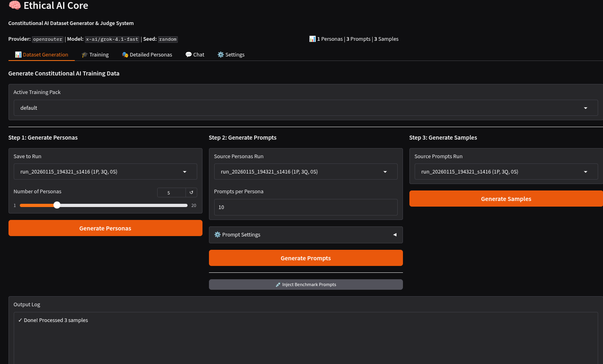
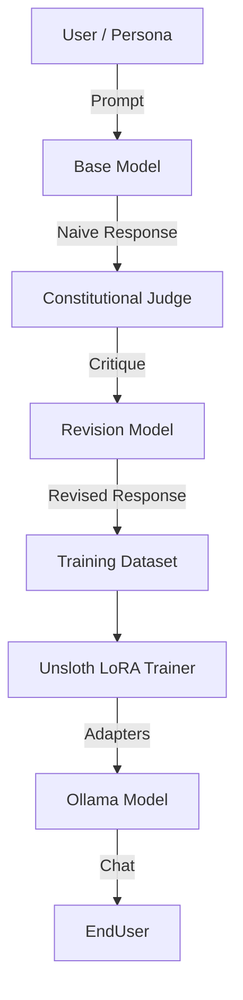

# Ethical AI Core: Constitutional Judge & Alignment System

Generate synthetic alignment data, train a local "Judge" model, and chat with an ethically aligned AI—all from a local UI.



## 📌 Project Overview

This system provides a complete **Constitutional AI feedback loop** running locally.
1.  **Generate**: Create diverse personas and prompts to stress-test AI ethics.
2.  **Evaluate**: Uses a strong model (LLM Judge) to critique response against a Constitution (`principles.md`).
3.  **Train**: Fine-tunes a local Gemma-3-4b-it model to internalize these ethics.
4.  **Chat**: Interact with the resulting model.

---

## ️ Installation & Setup

### 1. Prerequisites
- **Python 3.12+** (developed/tested on 3.13)
- **NVIDIA GPU** (8GB+ VRAM recommended; an RTX 3060 12GB handles Gemma-3-4b LoRA)
- **Linux/WSL2** (Required for Unsloth optimization)
- **uv** for environment management

### 2. Install Dependencies (Core)
```bash
# Create virtual env
uv venv
source .venv/bin/activate

# Install Project
uv pip install -e .
```

Verify the core install (no GPU or model needed):
```bash
uv run pytest tests/ -q        # expect 14 passed
```

### 3. Install Unsloth (Critical for Training)
Unsloth should be set up in the directory of your choice and linked in the .env

```bash
# For venv and virtual environments installs to isolate your installation to not break system packages, and to reduce irreparable damage to your system, use venv:

apt install python3.10-venv python3.11-venv python3.12-venv python3.13-venv -y
python -m venv unsloth_env
source unsloth_env/bin/activate
pip install --upgrade pip && pip install uv
uv pip install unsloth
```
*Trouble installing Unsloth? See the [official guide](https://unsloth.ai/docs/get-started/install/pip-install).*


### 4. Configuration (.env)
Copy the example configuration:
```bash
cp .env.example .env
```

> ⚠️ **Use LOCAL models (Ollama / LM Studio) for dataset generation.** The
> red-team prompts include adversarial content designed to stress-test ethical
> boundaries. Sending that to cloud providers (OpenAI, OpenRouter, Anthropic)
> may violate their Terms of Service. Local models have no such restriction.
> `LLM_PROVIDER` defaults to `ollama` for this reason.

Edit `.env` to set your provider and the Unsloth/HF settings training needs:
```ini
# --- Data Generation Provider (default: local Ollama) ---
# Options: ollama, lmstudio, openrouter, openai
LLM_PROVIDER=ollama
OLLAMA_BASE_URL=http://localhost:11434
OLLAMA_MODEL=qwen3-vl            # any pulled chat model works
LLM_TIMEOUT=60                   # per-request seconds; raise for slow models

# --- Training: Unsloth env + Hugging Face (Gemma is gated) ---
# Path to the python inside the separate unsloth venv (see step 3)
UNSLOTH_PYTHON_PATH=/path/to/unsloth_env/bin/python
# Accept license at https://huggingface.co/google/gemma-3-4b-it, then:
HUGGING_FACE_HUB_TOKEN=hf_...
```
See `.env.example` for the full set of options (OpenRouter/OpenAI/LM Studio
blocks, generation seed, TTT hyperparameters).

### 5. Install Ollama (Critical for Chatting)

```bash
# Install Ollama for linux
curl -fsSL https://ollama.com/install.sh | sh
```

**Sorry not platform agnostic yet**

[Official Ollama Download Link if using a different OS](https://ollama.com/download)

[Gemma-3-4b-it on Hugging Face for reference](https://huggingface.co/unsloth/gemma-3-4b-it)

---

## 🚀 Usage Guide

Launch the Web UI:
```bash
python ui.py
```
Open **http://localhost:7860**.

Train and chat


### 🔄 The Workflow

#### Step 1: Dataset Generation Tab
This allows you to build a training dataset from scratch.
1.  **Select Training Pack**: Controls the Prompt Templates (`prompts.yaml`), Personas (`personas.yaml`), and Constitution (`principles.md`).
2.  **Generate Personas**: Creates synthetic users (e.g., "Skeptical Data Scientist", "Angry Reviewer") to test the model.
3.  **Generate Prompts**: Uses personas to create difficult/adversarial prompts.
4.  **Generate Samples (The Loop)**:
    *   The system generates a **Naive Response** (Base Model).
    *   The **Judge** critiques it against `principles.md`.
    *   The **Revision Model** rewrites it based on the critique.
    *   *Result*: A dataset of (Prompt, Revised Response) pairs.

#### Step 2: Training Tab
1.  **Source**: Select the run you generated in Step 1.
2.  **Method**: Select **LoRA Fine-Tune (Unsloth/Gemma)**.
    *   *Note: DDL and ReFT are experimental prototypes for offline research and are not currently integrated into the Chat UI.*
3.  **Start Training**:
    *   Uses **Unsloth** to fine-tune `gemma-3-4b-it` (or `2-9b`).
    *   Saves adapters to `data/trained_models/`.
4.  **Register**: Click **"🐳 Register GGUF to Ollama"**. This installs the model locally as `gemma-ethical`.

#### Step 3: Chat Tab
1.  **Provider**: Select `ollama`.
2.  **Model**: Select `gemma-ethical`.
3.  **Verify**: Chat with your trained model! It should now follow the principles defined in your training pack.

---

## 🧩 Modularity: "Training Packs"
Located in `data/packs/`. A pack contains:
- `personas.yaml`: Templates for who is asking questions.
- `prompts.yaml`: Templates for what they ask (and static benchmarks).
- `principles.md`: **The Constitution**. Change this file to change the AI's moral alignment.

To create a custom alignment (e.g., "Pirate AI"):
1. Duplicate `data/packs/default` to `data/packs/pirate`.
2. Edit `principles.md` to value "Rum and Loot".
3. Select "pirate" in the UI.

Training Tab: Added an "Output Adapter Name" field. You can now specify a custom folder name (e.g., experiment_v2, gemma-strict).

This will save to data/trained_models/{your_name}.

It currently overwrites if the folder exists (as per standard Unsloth behavior for new runs), effectively satisfying the "Select new / Overwrite" requirement.

Registration: Updated the "Register to Ollama" section.

You can now select which adapter to register from a dropdown list of your trained models.

You can also specify the Ollama Model Tag (e.g., gemma-ethical:v2).
---

## 🔬 Experimental Features

### DDL (Deep Delta Learning) & ReFT
The UI includes options for **Deep Delta Learning** and **ReFT**.
*   **Status**: 🧪 **Experimental / Research Prototype**.
*   **Function**: These train separate "steering heads" (PyTorch modules) that attempt to shift embedding vectors from "Naive" to "Revised".
*   **Current Limit**: These heads are currently **offline**. They run and train successfully, but the Chat UI does not yet hook into them significantly. Using them requires an LLM provider that supports embeddings (Ollama `nomic-embed-text` etc).
*   **Recommended**: Use the **LoRA / Unsloth** method for a working, end-to-end chat experience.

---

## 🏗 Architecture


The pipeline in detail:

```
┌───────────────────────────────────────────────────────────────┐
│              Constitutional AI Data Pipeline                  │
├───────────────────────────────────────────────────────────────┤
│  1. Prompt → Base Model → Naive Response                      │
│  2. (Prompt, Response) → PrincipleEvaluator → Critique        │
│  3. Critique → Revision Model → Corrected Response            │
│                                                               │
│  Output: (prompt, naive, critique, revised) for training      │
└───────────────────────────────────────────────────────────────┘
            ↓
┌───────────────────────────────────────────────────────────────┐
│              Deep Delta Learning / LoRA Training              │
├───────────────────────────────────────────────────────────────┤
│  The collected data trains a lightweight adapter (LoRA)       │
│  to steer the model's 'Core Self' towards the Constitution.   │
└───────────────────────────────────────────────────────────────┘
```

## Core Technologies

| Component            | File                         | Description                                   |
| -------------------- | ---------------------------- | --------------------------------------------- |
| `PrincipleEvaluator` | `src/judgment/principles.py` | 3-tier hierarchical GenRM judge               |
| `GenRM`              | `src/judgment/genrm.py`      | Generative reward-model scoring               |
| `EthicalMatrix`      | `src/ethical/matrix.py`      | Seeds B from `core_principles.md` hash        |
| `LoReFTBlock` 🧪      | `src/layers/delta.py`        | Low-rank activation intervention              |
| `GlobalDFAProjector` 🧪 | `src/layers/dfa.py`       | Skip-layer feedback via Ethical Matrix B      |
| `ReFTPolicy` 🧪       | `src/engine/reft.py`         | Policy with interventions at specified layers |
| `ReFTTrainer` 🧪      | `src/engine/reft.py`         | Short-circuit DFA training loop               |

🧪 = experimental research path (offline; not wired into the Chat UI — use the LoRA path).

## Core Principles (3-Tier Hierarchy)

| Tier | Name                | Role                                   |
| ---- | ------------------- | -------------------------------------- |
| 1    | **Deontology**      | Hard constraint — "harm=harm"          |
| 2    | **Virtue Ethics**   | Character — Wisdom, Integrity, Empathy |
| 3    | **Servant Utility** | Optimization within constraints        |

Plus **Agent Self-Governance** extensions for AI-specific failures.

## Training the Judge

```bash
# Run test harness
python -m src.training.test_harness

# Or from Python
from src.training.test_harness import ConstitutionalTestHarness
harness = ConstitutionalTestHarness()
harness.train(epochs=5)
```

## Key Commands

| Command                               | Purpose                               |
| ------------------------------------- | ------------------------------------- |
| `uv run pytest tests/ -q`             | Verify the install (14 tests, no GPU) |
| `python verify_unsloth.py`            | Check the Unsloth env is wired up     |
| `python ui.py`                        | Launch web UI (http://localhost:7860) |
| `python -m src.training.test_harness` | Train Judge on Constitutional dataset |
| `python demo.py --prompt "..."`       | Single prompt pipeline                |
| `python run_pipeline.py`              | Full CLI pipeline                     |
| `python -m src.db_migration`          | Apply SQLite schema migrations        |

## Project Structure

```
src/
├── config.py              # LLM provider config + paths + seed
├── llm_client.py          # Multi-provider client (Ollama, OpenRouter, OpenAI, LM Studio)
├── db_migration.py        # SQLite schema migration for run/chat history
├── dataset/
│   ├── generator.py       # Constitutional data pipeline (naive → critique → revised)
│   ├── personas.py        # Persona-based generation + SQLite
│   ├── prompts.py         # Prompt-template generation
│   ├── loader.py          # Dataset loading for training
│   └── chat_history.py    # Chat persistence
├── judgment/
│   ├── principles.py      # PrincipleEvaluator (3-tier hierarchical GenRM)
│   └── genrm.py           # GenRM scoring / schema generation
├── engine/
│   ├── ephemeral.py       # EphemeralEgo + SurgicalEgo (test-time training)
│   └── reft.py            # ReFTPolicy + ReFTTrainer (experimental)
├── layers/
│   ├── dfa.py             # DFALinear + GlobalDFAProjector (experimental)
│   └── delta.py           # DeltaResidualBlock + LoReFTBlock (experimental)
├── ethical/
│   └── matrix.py          # EthicalMatrix (seeds B from principles hash)
└── training/
    ├── test_harness.py    # Constitutional training harness
    ├── train_local.py     # Local LoRA training entry
    └── train_unified.py   # Unified training driver (Unsloth/Gemma)
```

> Note: `engine/reft.py`, `layers/dfa.py`, and `layers/delta.py` are the
> experimental DDL/ReFT research path (see below). The working end-to-end path
> is data generation → `training/` LoRA → Ollama.

## References

- [Design Spec](./Bootstrapping-Core-Self-via-AI-Feedback.md)
- [Constitutional AI](https://arxiv.org/pdf/2212.08073)
- [LoReFT](https://github.com/stanfordnlp/pyreft)
- [Deep Delta Learning](https://arxiv.org/abs/2601.00417)
