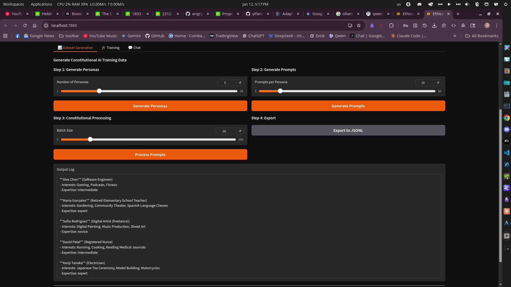

# Ethical AI Core

**Constitutional AI Dataset Generator & Judge System**

Implements the Ephemeral Judgment Layer architecture from [Bootstrapping-Core-Self-via-AI-Feedback.md](./Bootstrapping-Core-Self-via-AI-Feedback.md).

## Purpose

Generate training data for a **Judge** that evaluates AI agent behavior against hierarchical principles — detecting shortcuts, deception, hidden complexity, and Moloch patterns.

**This is NOT about controlling user requests.** It's about training a model to catch when AI agents:

- Hide issues or take shortcuts
- Claim false certainty
- Are sycophantic or deceptive
- Exhibit Moloch patterns (optimizing appearance over substance)

## Quick Start

```bash
# Setup
uv venv && source .venv/bin/activate
uv pip install -e .

# Configure local LLM
cp .env.example .env
# Edit .env with your model (default: Ollama)

# ⚠️  WARNING: Use LOCAL models only for dataset generation!
# Red team prompts may trigger cloud provider ToS violations.

# Launch Web UI
python ui.py
# Open http://localhost:7860

# Or use CLI
python demo.py --prompt "Is this code correct? def add(a, b): return a - b"
python demo.py --personas  # Generate personas + prompts
python run_pipeline.py     # Full pipeline with controls at top
```

## Web UI (Recommended)

```bash
python ui.py
```

**Tabs:**

1. **📊 Dataset Generation** — Generate personas, prompts, process through Constitutional pipeline
2. **🎓 Training** — Train Deep Delta Learning Judge from flagged samples
3. **💬 Chat** — Chat with the system (responses evaluated by Judge)



## Architecture

```
┌─────────────────────────────────────────────────────────────┐
│              Constitutional AI Data Pipeline                │
├─────────────────────────────────────────────────────────────┤
│  1. Prompt → Base Model → Naive Response                    │
│  2. (Prompt, Response) → Critique Model → Hierarchical Eval │
│  3. Critique → Revision Model → Corrected Response          │
│                                                             │
│  Output: (prompt, naive, critique, revised) for training    │
└─────────────────────────────────────────────────────────────┘
            ↓
┌─────────────────────────────────────────────────────────────┐
│              Deep Delta Learning (DDL) Judge                │
├─────────────────────────────────────────────────────────────┤
│  Surgical erasure: learns k (direction) and v (target)      │
│  Projects "bad behavior" → corrected without full training  │
└─────────────────────────────────────────────────────────────┘
```

## Core Principles (3-Tier Hierarchy)

| Tier | Name                | Role                                   |
| ---- | ------------------- | -------------------------------------- |
| 1    | **Deontology**      | Hard constraint — "harm=harm"          |
| 2    | **Virtue Ethics**   | Character — Wisdom, Integrity, Empathy |
| 3    | **Servant Utility** | Optimization within constraints        |

Plus **Agent Self-Governance** extensions for AI-specific failures.

## Key Commands

| Command                         | Purpose                              |
| ------------------------------- | ------------------------------------ |
| `python ui.py`                  | Launch web UI                        |
| `python demo.py --prompt "..."` | Single prompt pipeline               |
| `python demo.py --personas`     | Demo persona generation              |
| `python demo.py --generate N`   | Generate N training samples          |
| `python run_pipeline.py`        | Full pipeline (edit controls at top) |
| `python -m pytest tests/ -v`    | Run test suite                       |

## Project Structure

```
src/
├── config.py              # LLM provider config
├── llm_client.py          # Multi-provider client
├── dataset/
│   ├── generator.py       # Constitutional data pipeline
│   ├── personas.py        # Persona-based generation + SQLite
│   └── prompts.py         # Red team prompts by category
├── judgment/
│   ├── principles.py      # Hierarchical evaluator
│   └── genrm.py           # Generative Reward Model
├── engine/
│   └── ephemeral.py       # TTT engine (EphemeralEgo)
└── layers/
    ├── dfa.py             # Direct Feedback Alignment
    └── delta.py           # Deep Delta Learning
```

## References

- [Design Spec](./Bootstrapping-Core-Self-via-AI-Feedback.md)
- [IDE Guide](./ASSISTANT.md)
- [Constitutional AI](https://arxiv.org/pdf/2212.08073)
- [Deep Delta Learning](https://arxiv.org/abs/2601.00417)
